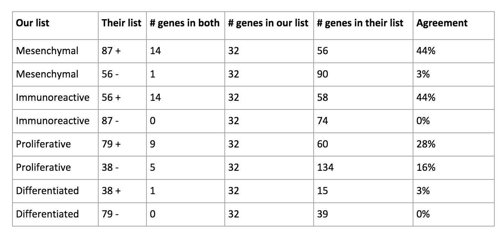

# Re-analyzing the Latent Space of Cancer Transcriptomes

**Yang Liu and Jeffrey Heer**

A meaningful latent space learned by unsupervised algorithms can be a powerful tool to assist scientific discovery. We might use various methods to interpret the latent space, for instance inspecting cluster structures. However, it is dangerous to fixate on the meaning of individual latent dimensions (features, or colloquially “neurons”): rotating the latent space and updating the decoder will produce identical results, but the original features are not preserved. To illustrate this issue, we present an analysis of a latent space of gene expression data in cancer patients, fit using a Variational Auto-Encoder by [Way & Greene](https://github.com/greenelab/tybalt) [1]. Starting from Way & Greene’s goals of finding genes identifying patient sex and genes differentially expressed in high grade serous ovarian cancer subtypes, our approach involves finding a maximally discriminative vector (rather than projecting on a single learned dimension) and performing full non-linear decoding (rather than examining layer weights only). Our analysis of patient sex reaches the same conclusion as Way & Greene, as our learned vector combining multiple latent dimensions is oriented similarly to original latent feature used in [1]. However, for cancer subtype analysis, we find interesting differences between the genes most differentially expressed between subtypes; in some cases, the genes identified by our and their methods have zero agreement. We believe that these results caution against the isolated interpretation of original latent space dimensions.

## PATIENT SEX ANALYSIS
We start by finding a hyperplane that better separates patient sex by considering contributions from multiple latent space dimensions. To do this, we fit a linear SVM in the latent space, which achieves 99.7% classification accuracy on the training data. We then take a vector orthogonal to the decision hyperplane: this vector is similar to encoding 82 in [1], with a cosine similarity of 0.722.

To find the genes that are most differentially expressed between female and male, we decode the vector to the output (gene profile) space, and identify a list of genes with largest absolute difference. The resulting top 17 genes are exactly the same as those reported in [1].

While encoding 82 does not separate patient sex as well as the linear SVM hyperplane, it does have a similar direction. This explains why we arrive at the same conclusion.

## CANCER SUBTYPE ANALYSIS

Now we turn to the analysis of high grade serous ovarian cancer subtypes. We conducted a similar analysis involving vector arithmetic. Here are our steps, using the *immunoreactive* and *mesenchymal* pair as an example:

1. We first compute the centroid of each subtype in z, namely  and .
2. We run both  and  through the decoder to reconstruct the corresponding gene profiles  and . We subtract to get the signed difference .
3. Following [1], we next look to threshold for genes 2.5 standard deviations away in both positive and negative tails. However, the distribution is not normal and so we use quantile-based thresholding. We first find the quantiles corresponding to 2.5 standard deviations in a standard normal distribution (0.06% and 99.4%, respectively). We then take the corresponding top and bottom quantiles of  to form the gene list. The genes in the positive tail are associated with the *mesenchymal* subtype, while the genes in the negative tail are associated with *immunoreactive*.

The major differences of our approach from [1] are: (1) we do not project the vector back to a single latent encoding dimension; (2) we apply the non-linear decoder function instead of directly inspecting decoder weights; and (3) we use quantile-based thresholding.

Below are visualizations (Figures 1-2) of how samples distribute along the two attribute vectors  and . Compared to the original latent encodings (Figure 3), these custom “axes” appear to better separate corresponding pairs of subtypes.

![fig1]

**Figure 1.** Distribution along the *mesenchymal* - *immunoreactive* vector 

![fig2]

**Figure 2.** Distribution along the *proliferative* - *differentiated* vector 

![fig3]

**Figure 3.** Distributions along original latent encoding dimensions (from [1]).

We then compare the overlap between our resulting gene list and that of [1]. The agreement is notably poor, including multiple cases with a null intersection.



We also ran the gene list through pathway analysis and the results show interesting differences to those of [1]. However we do not have sufficient biological knowledge to judge if these differences are sensible. These results are in the folder `result/pathway` of our GitHub repository.

## REFERENCES

[1] Way, Gregory P., and Casey S. Greene. "Extracting a biologically relevant latent space from cancer transcriptomes with variational autoencoders." bioRxiv (2017): 174474.

## DATA AND SCRIPTS
All code and results are in this GitHub repository.

### Folder structure
- scripts: python code and some plots
- data, models: input data
- results: gene lists and pathway analysis results

### Getting started
Install dependencies:
```
conda env create --force --file environment.yml
source activate tybalt
```

Run scripts:
```
cd scripts

# patient sex
python sex.py

# cancer subtypes
python hgsc_subtypes_tybalt.py
```

[t-m]:images/resized/theta_mes.png
[t-i]:images/resized/theta_immuno.png
[t-mi]:images/resized/theta_mes_immuno.png
[t-pd]:images/resized/theta_prolif_diff.png
[x-i]:images/resized/x_immuno.png
[x-m]:images/resized/x_mes.png
[x-mi]:images/resized/x_mes_immuno.png
[eq1]:images/resized/eq1.png
[fig1]:scripts/result/mesen-immuno-swarm.png
[fig2]:scripts/result/pro-def-swarm.png
[fig3]:images/fig3.png
[table]:images/table.png
